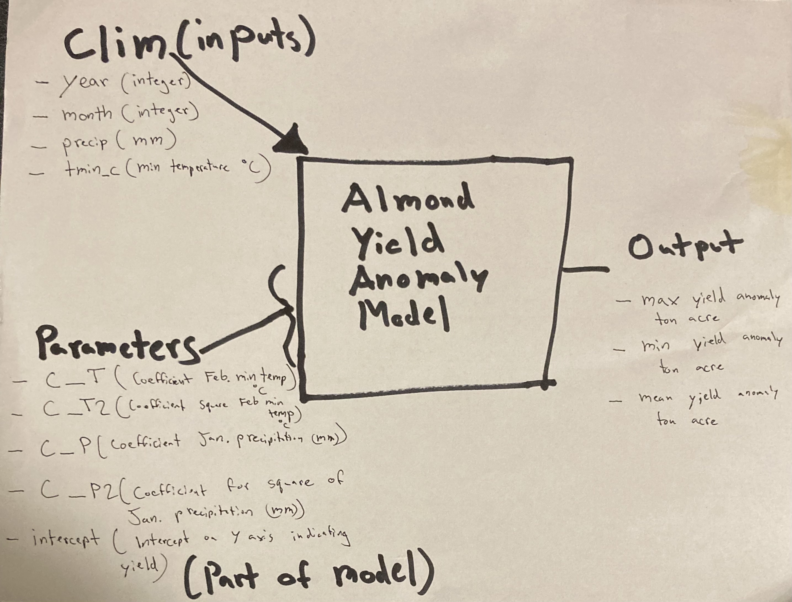

# Almond Yield Model

## Conceptual Almond Model



## Load Packages and Functions

```{r, warning = FALSE, message = FALSE}
# Load libraries
library(here)
library(tidyverse)
```

```{r}
# Call almond function
source(here('assignments/assignment1/I_Morris-Sibaja_S_Carroll_almond_model.R'))
```

## Apply the Function

```{r}
# Read in climate data
clim_data <- read.table(here::here("data/clim.txt"), header = TRUE)

# Assign almond parameters to variables
parameters <- list(
  c_T = -0.015,
  c_T2 = -0.0046,
  c_P = -0.07,
  c_P2 = 0.0043,
  intercept = 0.28
)

# Run function
almond_model(clim_data, almond_params)
```

